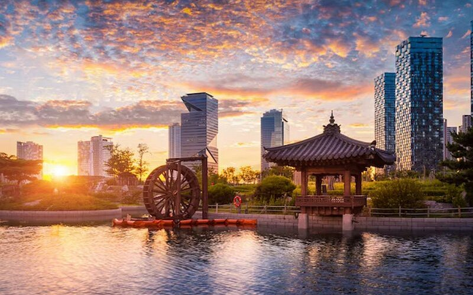
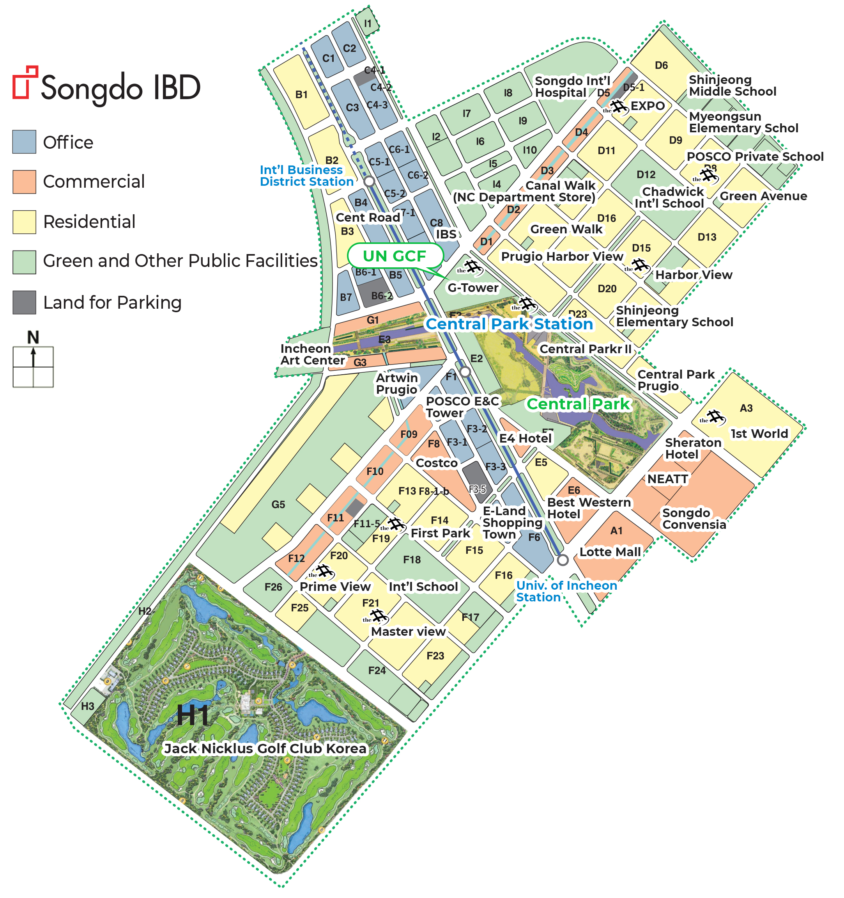
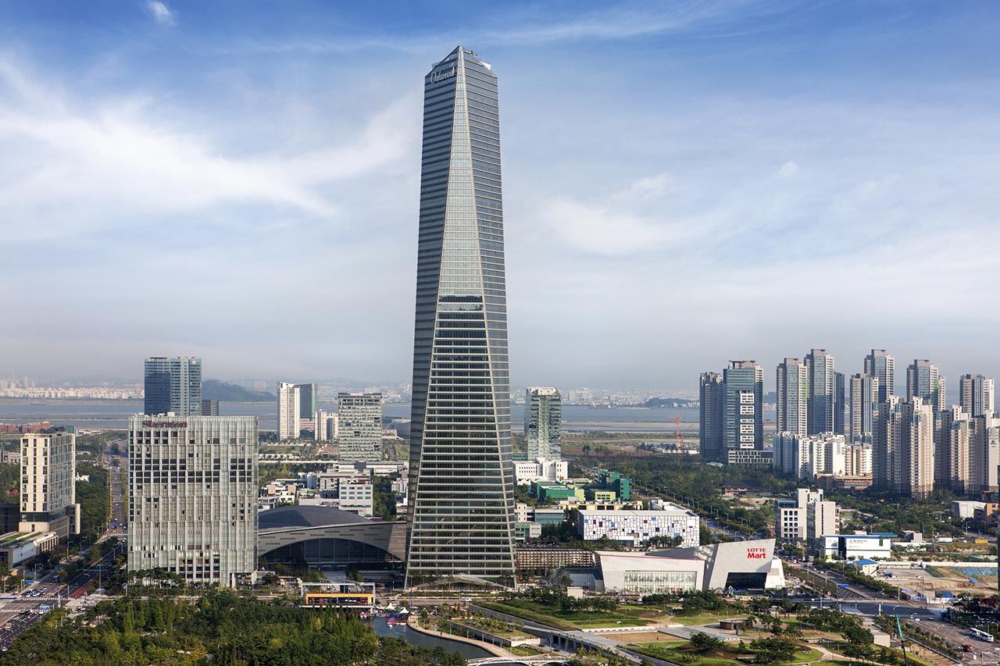
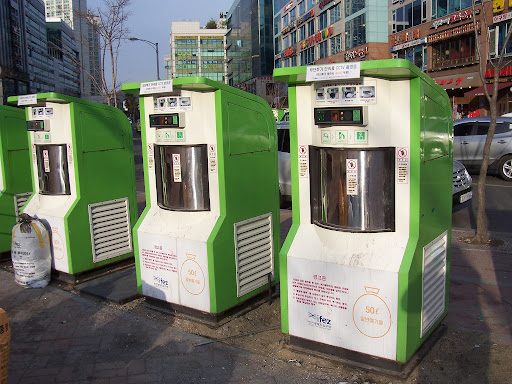

<!--
Allowed values:

type: district, plan

tags: Environment, Mobility, Buildings, Energy, InformationSystems, HealthEducation, InnovationSystems, CivicTech, CivicInnovation, Food

-->

## Overview

<!-- About 100 to 150 word summary of the case study. -->
Songdo International Business District (IBD) represents one of the world's most ambitious smart city initiatives, developed on 1,500 acres of reclaimed land along Incheon's waterfront in South Korea. Launched in 2001 as a joint venture between Gale International, POSCO E&C, and Incheon City, this $35 billion project aimed to create a sustainable urban center with global business appeal.

The development integrates advanced digital infrastructure, including citywide sensors, automated waste management, and centralized building controls. With 40% green space, LEED-certified buildings, and water recycling systems, Songdo prioritizes environmental sustainability. The city's design emphasizes walkability, mixed-use development, and public transportation to reduce carbon emissions. 

While Songdo has attracted international businesses and prestigious universities, it has faced challenges including slower-than-expected population growth and criticism regarding its somewhat sterile atmosphere. Nevertheless, it remains an influential model for planned smart cities worldwide. 

## Goals and Aspirations

<!-- What is the project trying to achieve? Identify 3-5 high-level goals that define the entire project. Replace the placeholder title with a succinct name for the goal. -->

**Global Business Hub**. Songdo IBD was designed to be a strategic economic catalyst to position South Korea as a premier Northeast Asian business hub. The project aims to attract multinational corporations, financial institutions, and international organizations by offering state-of-the-art facilities, favorable business regulations, and tax incentives within the Incheon Free Economic Zone. With its proximity to Incheon International Airport and major Asian markets, Songdo was designed to facilitate seamless global connectivity and commerce. The development includes the 68-story Northeast Asia Trade Tower, convention centers, and specialized districts for various industries. By creating this international business ecosystem, South Korea sought to diversify its economy beyond manufacturing, establish stronger international trade relationships, and create high-value employment opportunities that would strengthen its position in the global knowledge economy.

**Sustainable Urban Development**. Songdo IBD was envisioned as a model for environmentally responsible urban development, with sustainability integrated into every aspect of its design and operation. The city incorporates over 40% green space, including the 101-acre Central Park modeled after New York's landmark. All buildings are required to meet LEED certification standards, with many achieving Gold or Platinum status. The city's infrastructure includes a pneumatic waste collection system that eliminates the need for garbage trucks, a water recycling system that reduces consumption by 40%, and a district heating and cooling system that significantly improves energy efficiency. Rainwater collection, greywater recycling, and solar power generation further minimize the environmental footprint. By demonstrating that large-scale urban development can occur while prioritizing ecological preservation and resource efficiency, Songdo aims to set new global standards for sustainable city planning.

**Smart City Prototype**. Songdo was designed to showcase how integrated technology can enhance urban living and governance. The entire district operates on a digital backbone of sensors, networks, and automated systems that monitor and manage everything from traffic flow to energy consumption. Cisco's Smart+Connected Communities framework provides the technological infrastructure, including TelePresence units in homes, offices, and public spaces to facilitate virtual meetings and reduce the need for travel. The city's integrated operations center uses real-time data to manage utilities, security, and transportation systems. Buildings feature centralized climate controls, automated lighting, and smart energy grids. By creating this "city of the future," Songdo serves as a living laboratory for testing smart city technologies and protocols, providing valuable data on implementation challenges and benefits that can inform urban development worldwide. 

**Quality of Life Enhancement**. Songdo IBD was created with a strong focus on providing an exceptional quality of life for residents through thoughtful urban planning and comprehensive amenities. Songdo was designed to be an integrated 15-minute city where people can reach 90% of their daily activities by bike or public transportation in fifteen minutes or less. Songdo is also one of the few cities in South Korea that has city-wide bike lanes. In addition to that, the city's design prioritizes walkability with generous pedestrian paths and public spaces. The 25-kilometer network of parks and greenways ensures that nature is always accessible, while mixed-use development places homes, workplaces, schools, and leisure facilities in close proximity to reduce commute time. 

**Global Community & Cultural Exchange**. Songdo also sets out to foster a globally inclusive community. This city was planned with an international demographic in mind- offering English-speaking schools, healthcare facilities, cultural centers, and a variety of global culinary and lifestyle options. Songdo hoped to become a melting pot of cultures and ideas. 

## Key Characteristics

<!--  How is the project organized into specific activities that advance these goals? For plans: How does the plan address each of the three activities in digital master plans (development, engagement, implementation). For districts: How does the district employ 3-5 of the key characteristics of innovation hubs?
-->

**Integrated Urban Planning & Design**. Songdo IBD exemplifies comprehensive urban planning where every element serves multiple goals simultaneously. This neighborhood-scale development project deliberately integrates business, residential, educational, and recreational zones to create a cohesive urban ecosystem. The grid-based layout incorporates wide boulevards, pedestrian-friendly streets, and dedicated cycling paths that connect all districts, promoting mobility while reducing carbon emissions. Building height restriction and strategic placement of landmarks ensure visual harmony while maximizing natural light. The waterfront design incorporates flood protection measures alongside recreational facilities. This integrated approach extends underground, where utility systems are housed in accessible tunnels that allow for maintenance without disrupting street-level activities. By designing with multiple functions in mind, Songdo achieves greater efficiency in land use while creating a more livable environment for residents and workers. 

**Knowledge Infrastructure**. Songdo IBD brings together educational institutions, research facilities, and innovative businesses to foster collaboration and advancement. The Incheon Global Campus hosts extensions of leading international universities including the State University of New York, George Mason University, University of Utah, and Ghent University. Research institutes focused on biotechnology, information technology, and sustainable development provide specialized knowledge resources. The Songdo Convensia Convention Center and numerous corporate R&D facilities create spaces for knowledge exchange across sectors. By prioritizing knowledge infrastructure, Songdo creates an environment where innovation naturally emerges from the interaction between academia, industry, and technology. 

**Public-Private Partnerships**. Songdo IBD is one of the largest and most comprehensive public-private partnership models around the globe. The initial framework was established between Incheon City, POSCO E&C (a Korean construction giant), and Gale International (a Boston-based developer). South Korean government provided regulatory support through the Incheon Free Economic Zone designation, which offers tax incentives and streamlined administrative processes. Cisco Systems played a crucial role by developing the city's digital backbone, while United Technologies contributed to the building automation systems. The Korean Land Corporation contributed by managing land reclamation and preparation. These partnerships extend beyond infrastructure to service delivery. This collaborative approach allowed Songdo to leverage private sector expertise and investment while ensuring public oversight maintained alignment with national economic and social objectives. 

**Innovative Sustainability Systems**. Songdo IBD incorporates cutting-edge sustainability technologies that function as interconnected systems rather than isolated features. The city's pneumatic waste disposal system is a great representation: automated vacuum tubes transport waste directly from buildings to central processing facilities, eliminating garbage trucks, reducing emissions, and enabling efficient waste sorting and recycling. The water management system collects rainwater from buildings and public spaces, reuses greywater, and reduces potable water consumption by about 40%. Songdo's district heating and cooling system centralizes temperature control, which is much more efficient than the individual building systems. Building automation technologies adjust lighting, heating, and cooling based on occupancy and external conditions, minimizing resource waste. These systems are monitored and optimized through a central operations center that collects real-time data. To sum up, by treating sustainability as an integrated challenge rather than implementing isolated green features, Songdo achieves environmental benefits and highlights how technology can make sustainable living both convenient and economical. 

**Strategic Global Connectivity**. Located just 15 minutes away from Incheon International Airport, Songdo IBD has direct access to over 90 international cities. This physical connectivity is enhanced by digital infrastructure that supports virtual collaboration across borders. Cisco's TelePrescence centers throughout the city enable high-definition video conferencing with partners worldwide. The city actively courts international organizations and has successfully attracted the Green Climate Fund headquarters, the World Bank Korea office, and the UN Office for Sustainable Department. Songdo's international schools, multilingual signage, and culturally diverse amenities create an environment where global talents can easily transition and connect. 

## Stakeholders
<!--  Who initiated the project? Who is leading the project forward? Who else has a say in how it unfolds? Who is directly affected but marginalized? Identify 3-5 key stakeholder organizations or groups. Identify 3-5 key individuals. These are people who are associated with the project as leaders, supporters, critics, or regulators. They are likely to be members of the stakeholder groups identified above. These are people you should try to contact for one or more interviews.-->

**Gale International**.  As the primary developer of Songdo IBD owning a 60% share of the project, this Boston-based real estate development company has been the driving force behind the project since its inception. After securing the development rights in 2001, Gale International has invested billions in the project and overseen its master planning and implementation. The company has leveraged its international connections to attract global businesses and institutions to Songdo. Their vision for Songdo as a sustainable, high-tech business district has shaped every aspect of the development, from architectural decisions to technological infrastructure. [Gale International](http://www.galeintl.com/)

**Incheon Metropolitan City Government**.  Despite the fact that the project is 100% privately owned and funded, as the local government authority, Incheon has still played a crucial role in enabling Songdo's development through regulatory support, infrastructure investment, and political backing. The city government designated Songdo as part of the Incheon Free Economic Zone (IFEZ), which creates very favorable conditions for international businesses and investors. Incheon has also invested in transportation links, including subway connections, highways, and bridges that connect Songdo to the broader metropolitan region. The city government maintains oversight of the project to ensure that it aligns with broader urban development goals while representing the interests of local residents. With this project, Incheon aims to transform itself from an industrial port city into a global business and technology hub. [Incheon Metropolitan City Government](https://www.incheon.go.kr/en/index)

**POSCO Engineering & Construction (POSCO E&C)**.  As Gale International's primary Korean partner and one of the nation's largest construction companies, POSCO E&C has been important in executing Songdo's architectural and engineering plans. The company has contributed not only construction expertise but also knowledge of Korean building practices, regulations, and supply chains. POSCO E&C has implemented the project's sustainable design elements, including LEED-certified buildings and district-wide utility systems. Their stake in the project extends beyond construction to include equity investment, with the company owning a significant portion of the development alongside Gale International. The financial commitment has given POSCO E&C a big influence over project decisions, particularly as market conditions have fluctuated over the development's two-decade evolution. [POSCO E&C](https://www.poscoenc.com/en/)

**Cisco Systems**.  As the technology partner for Songdo IBD, Cisco has played a pivotal role in creating the digital backbone that enables the district's smart city features. Through its Smart+Connected Communities initiative, Cisco designed and implemented the networks, sensors, and integrated systems that monitor and manage Songdo's infrastructure. Cisco's TelePresence units throughout Songdo provide high-definition video conferencing capabilities in homes, offices, and public spaces. As a stakeholder, Cisco has an interest not only in Songdo's success but also in promoting the replicability of its technology solutions in other urban developments worldwide. [Cisco Systems](https://www.cisco.com/)

**Residents**.  Although often overlooked in the discussion of Songdo's development, the residents are a critical stakeholder group whose daily experiences test the project's ambitions. Compromising primarily middle to upper-middle-class professionals, many with international backgrounds, Songdo's residents have been attracted by promises of convenience, sustainability, and quality of life. However, they have also encountered challenges, including initially limited retail and entertainment options, a sometimes sterile atmosphere, and the adjustments required by living in a highly monitored environment. Residents' feedback has influenced later phases of development, leading to more diverse amenities and community spaces. 

## Technology Interventions
<!--  What specific technology-enabled interventions does the project propose? Identify 3-5 technology interventions. Describe use cases, value proposition, solution architecture, data created or consumed, key platforms and standards, business models, regulatory issues, etc. Separate into more than 1 paragraph as needed. This is a good place to insert additional images, be sure to include captions identifying the source and make sure to not use copyrighted images. -->

**Pneumatic Waste Collection System**. Songdo IBD implemented an automated underground pneumatic waste system that eliminates the need for traditional garbage trucks and manual waste collection. Residents and businesses deposit waste into designated inlet valves categorized by waste type (i.e., general waste, recyclables, food waste). The waste is then automatically transported through underground pneumatic tubes into a central waste processing facility where it is sorted, processed, and prepared for disposal or recycling. This system improves urban aesthetics, reduces air and noise pollution, enhances hygiene, and lowers operational costs with 70% fewer sanitation workers required. Additionally, it operates 24/7 so the waste can be removed immediately instead of accumulating until collection day. The system was developed by Swedish company Envac and utilizes their proprietary control systems while adhering to Korean waste management regulations. The system was initially funded through capital investment from the development consortium, with ongoing operational costs covered through resident and commercial use fees integrated into maintenance charges. The reduced labor costs save money in the long term compared to the traditional approaches, with an estimated break-even point of 12-15 years after implementation. 

However, as the public waste bins on streets are inaccessible to non-residents since they require RFID keys, it leads to issues like unintended litter accumulation around the bins. Also, the bins are designed at a height that is inaccessible to wheelchair users. 

**Integrated Operations Center (IOC)**.  Functioning as the central nervous system of the city, the Integrated Operations Center collects and analyzes data from all the sensors and systems throughout Songdo. The IOC monitors transportation flows, energy usage, water systems, public safety, and environmental conditions. This centralized approach improves operational efficiency, reduces response time to incidents, enables preventive maintenance through early detection of potential issues, and conducts data analytics to continuously improve urban services. It also supports Songdo's sustainability goals by optimizing energy and water consumption in real-time. The IOC consists of a physical command center with large visualization displays, advanced computing infrastructure, specialized software systems, and connections to thousands of IoT devices throughout the district. It utilizes Cisco's City Operations Platform as its primary software backbone,  with additional specialized systems for specific domains such as energy and transportation. 

Despite the benefits it provides, the comprehensive data collection has raised privacy concerns, which requires careful implementation of data anonymization, security protocols, and compliance with South Korean personal information protection laws. 

**Building Automation Systems (BAS)**.  Songdo's buildings are equipped with comprehensive automation systems that control and optimize heating, ventilation, air conditioning (HVAC), lighting, access control, and other building functions. They operate both at the individual building level and connect to district-wide networks. Occupants can control their individual environments through smartphone apps, while building managers have comprehensive dashboards. The BAS significantly improves energy efficiency, with a 15-30% reduced consumption compared to typical buildings. It also improves security through integrated access management and reduces operational costs through preventive maintenance and optimized staffing. To achieve these, each building has a network of sensors (e.g., temperature, humidity, light levels), actuators (HVAC controls, lighting systems, motorized blinds), and local controllers connected to a central building management system (BMS). These building-level systems connect to the district energy management network for load balancing and shared resources.

## Financing
<!--  How are the technology interventions identified to be financed? How does this fit into financing of the larger project? Identify at least one financing mechanism that is being used. -->

Songdo IBD is one of the largest privately funded urban development projects in history, with a total investment estimated at $35 billion. The financing approach combined traditional real estate development models with innovative funding mechanisms that were designed to support the project's technology interventions. 

**Public-Private Partnership Capital Structure**.  The primary financing mechanism was the partnership between Gale International, (70% ownership initially, later decreased to 60%), a US-based developer that provided the initial vision and brought in early-stage capital, and POSCO E&C, (30% initially, later increased to 40%), which invested in both the construction and real estate components. This joint venture was formalized as NSIC (New Songdo International City Development LLC), which served as the project's primary developer and financing entity. 

Unlike many large urban development projects that heavily rely on public funding, the South Korean government's contribution to Songdo focused on regulatory support and surrounding infrastructure, rather than direct investment in the district itself. 

This partnership received initial financing through a combination of equity investments from the partners and debt financing from Korean banks such as Korea Development Bank and Woori Bank. As the project progressed, pre-sales of commercials and residential properties provided additional funding, which ensured the cash flow for ongoing development. 

**Bond Financing and International Investment**.  As Songdo gained international recognition, the developers accessed additional capital through international bond offerings. In 2012, Songdo IBD issued $500 million in green bonds to finance continued development of its sustainable infrastructure. These bonds were certified under the Climate Bond Initiative standards, which is appealing to environmentally-conscious investors seeking exposure to smart city technologies. 

The project also attracted direct foreign investment, especially from companies establishing operations in Songdo. These businesses often contributed to technology funding through customized build-to-suit arrangements that incorporated smart building features aligned with Songdo's overall technology vision. 

## Outcomes
<!-- What results has the project produced to date? What outcomes and impacts are anticipated? Identify 3-5 (anticipated) outcomes. What will/has the project achieved? Thes should not be the same or repeated from elsewhere. Use this space to emphasize something different. -->

**Economic Development**.  Songdo has partially succeeded in its goal of becoming a Northeast Asian business hub, though with more modest results than initially planned. The district has attracted about 70,000 residents and 33,000 jobs as of 2023, which is 65% of its targeted population and employment figures. Although slower than projected, Songdo has significant economic achievements in these aspects:

- International Organizations: Songdo has attracted the headquarters of the Green Climate Fund (GCF), the World Bank Korea office, and the UN Office for Sustainable Development, making Songdo a center for international sustainability organizations. 
- Corporate Investments: Major Korean companies like Samsung Biologics, Celltrion, and POSCO have established significant operations in Songdo, particularly in the biopharmaceutical sector, which has become a particular strength of Songdo.
- Educations: The Incheon Global Campus has successfully attracted international universities including SUNY, George Mason University, University of Utah, and Ghent University.

However, although Songdo offers tax incentives and modern facilities, it has struggled to attract the volume of multinational corporations initially projected. Many international companies maintain their regional headquarters in established mature business centers like Seoul, Tokyo, and Singapore.

**Technological Implementation and Innovation**.  In terms of technological outcomes, Songdo has successfully implemented many of its planned smart city systems, becoming one of the world's most extensively digitized urban environments. 

Specifically, the pneumatic waste collection system now serves over 90% of buildings and processes approximately 97 tons of waste daily with significant reductions in collection vehicle traffic and resulting emissions, which meet 80% achievement of its projected operational efficiencies. In terms of energy performance, buildings utilizing the comprehensive automation systems have shown 15-25% energy savings compared to conventional buildings in the region, though this is below the savings of 30% that initially envisioned. For its data integration, the Integrated Operations Center now monitors and manages data from over 300,000 sensors throughout the district, which enables coordinated management of urban systems. However, the targeted extensive ecosystem of third-party applications leveraging this data infrastructure has been slower to materialize than anticipated.

**Environmental Sustainability**.  The district has achieved an estimated 40% reduction in carbon emissions compared to conventional urban developments of similar scale, primarily through its energy-efficient buildings, the energy system, and reduced transportation emissions. In terms of its green space integration, on the other hand, the commitment to 40% green space has been successfully realized, with over 600 acres of parks, canals, and natural areas. In addition, Songdo contains the highest concentration of LEED-certified space in South Korea, with over 118 buildings achieving certification. Lastly, the district's water recycling systems also recover and reuse approximately 40% of greywater, which reduces potable water demand significantly below comparable urban areas in the region. Overall, the environmental outcomes may be considered Songdo's most outstanding success, and it shows the world that large-scale sustainable development is technically and economically feasible. 

**Social and Community Development**.  Songdo has predominantly attracted upper-middle-class families, with an average household income of approximately 1.4 times higher than the Korean average. However, this also has raised concerns about socioeconomic diversity and inclusion. The district has also attracted an international population, with 8% of residents, primarily associated with international schools and organizations. While this shows a higher diversity than most Korean cities, this falls short of the cosmopolitan global community initially projected. 

## Open Questions
<!-- What is uncertain, unclear, or still unresolved about this project? Identify 1-3 open question(s). -->

**Long-term Financial Sustainability and Top-Down Planning**.  While Songdo has secured financing for development, questions remain about its long-term financial viability with populations and business targets at only 65% of its projections. The project's top-down planning approach, which imposed a comprehensive vision rather than allowing for organic growth that happens naturally in most cities, may have limited its ability to adapt to market realities and community needs. Key unresolved questions include whether smart building premiums will persist as these features become standard elsewhere, how aging technological systems will be maintained and upgraded, and if the district can transition from a developer-driven model to a self-sustaining local economy that generates sufficient revenue without requiring continuous external investment. 

**Social Integration, Community Identity, and Affordability**.  Most critics of Songdo characterize it as feeling artificial and lacking the organic vibrancy of naturally evolved urban areas. High living costs have pushed away potential residents, which further limits socioeconomic diversity and a balanced community. This raises important questions about whether planned smart cities can develop the intangible qualities that make cities livable and liked by their inhabitants and how to balance global business orientation with local culture. 

## References

---

### Primary Sources

<!-- 3-5 project plans, audits, reports, etc. -->

- Person. “New Songdo City.” KPF, KPF, 18 Oct. 2023, www.kpf.com/project/new-songdo-city. 
- “Songdo IBD Official Website.” Songdonsic.Com, New Songdo International City LLC., www.songdonsic.com/en/home_en/. Accessed 10 Apr. 2025. 
- Songdo IBD, Gale International LLC., 2015, songdo.com/. 

### Secondary Sources

<!-- 5-7 secondary source documents: news reports, blog posts, etc.. -->

- Arbes, Ross, and Charles Bethea. “Songdo, South Korea: City of the Future?” The Atlantic, Atlantic Media Company, 4 Feb. 2015, www.theatlantic.com/international/archive/2014/09/songdo-south-korea-the-city-of-the-future/380849/. 
- Bartmanski, Dominik, et al. “Fabrication of space: The design of everyday life in South Korean songdo.” Urban Studies, vol. 60, no. 4, 14 Sept. 2022, pp. 673–695, https://doi.org/10.1177/00420980221115051. 
- Clewlow, Amy. “Three Smart Cities That Failed within Five Years of Launch.” Intelligent Buildtech, 26 Jan. 2024, www.intelligentbuild.tech/2024/01/26/three-smart-cities-that-failed-within-five-years-of-launch/#:~:text=Songdo%2C%20South%20Korea&text=The%20reasons%20attributed%20to%20its,social%20attractions%20making%20it%20unappealing. 
- Ellen, Sarah. “Designing Sustainable Cities: Songdo.” UNC Institute for the Environment, 20 Sept. 2023, ie.unc.edu/cleantech-story/designing-sustainable-cities-songdo/. 
- Kim, Yoon-jung, and Mack Joong Choi. “Contracting-out public-private partnerships in mega-scale Developments: The case of new songdo city in Korea.” Cities, vol. 72, Feb. 2018, pp. 43–50, https://doi.org/10.1016/j.cities.2017.07.021. 
- Mullins, Paul D. “The ubiquitous-eco-city of songdo: An urban systems perspective on South Korea’s Green City Approach.” Urban Planning, vol. 2, no. 2, 29 June 2017, pp. 4–12, https://doi.org/10.17645/up.v2i2.933. 
- Poon, Linda. “Songdo, South Korea’s Smartest City, Is Lonely - Bloomberg.” Bloomberg, 2018, www.bloomberg.com/news/articles/2018-06-22/songdo-south-korea-s-smartest-city-is-lonely.
- Williamson, Lucy. “Tomorrow’s Cities: Just How Smart Is Songdo?” BBC News, BBC, 2 Sept. 2013, www.bbc.com/news/technology-23757738. 
